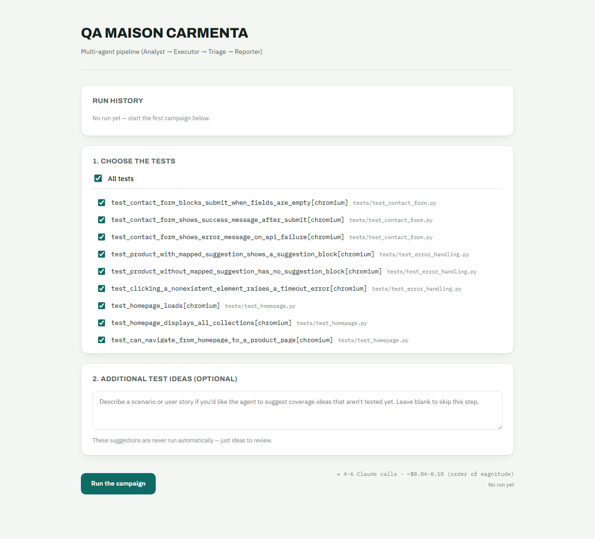

# multi-agent-qa

[](https://github.com/berangeregallais/qa-agent-supervisor/actions/workflows/tests.yml)
[](LICENSE)

A multi-agent pipeline (LangGraph + Claude API) that runs and analyzes the
Playwright tests of the **`maisoncarmenta-qa`** project. Orchestration,
not duplication: this project contains no tests of its own.



## Table of Contents

- [Overview](#overview)
- [Architecture](#architecture)
  - [How the two projects fit together](#how-the-two-projects-fit-together)
  - [The pipeline](#the-pipeline)
- [Getting Started](#getting-started)
  - [Prerequisites](#prerequisites)
  - [Installation](#installation)
  - [Running it](#running-it)
- [Cost](#cost)
- [Testing](#testing)
- [Project Structure](#project-structure)
- [Roadmap](#roadmap)
- [License](#license)

## Overview

`multi-agent-qa` drives an existing Playwright/pytest suite through four
specialized Claude agents (**Analyst**, **Executor**, **Triage**,
**Reporter**), coordinated by a LangGraph **Supervisor**. It runs the suite,
turns the JUnit report into structured results, categorizes failures, and
produces a two-level report (technical for dev/QA, plain-language for
non-technical stakeholders), all through a local web interface or a CLI.

**Key design decisions:**

- **No code generation.** An earlier version generated Playwright code on
  the fly from suggested test cases. Abandoned: the generated code did not
  consistently follow the Page Object Model and produced more false
  failures than real signal. The current version only runs the real,
  hand-written suite.
- **Flaky detection by proof, not guesswork.** A test that fails then
  passes within the same run (via `pytest-rerunfailures`) is categorized
  "flaky" deterministically: no LLM call needed for that case.
- **Cancelable runs.** Every run executes in a background thread; the
  in-progress `pytest` subprocess can be killed directly from the
  interface.

## Architecture

### How the two projects fit together

```text
../maisoncarmenta-qa/     <- the REAL Playwright tests (Page Objects,
                              fixtures, pytest.ini). Can run standalone,
                              without this project.
./  (multi-agent-qa)      <- drives maisoncarmenta-qa from the outside:
                              runs pytest against it, reads its JUnit
                              report, has Claude agents analyze the
                              results, and displays everything in a web
                              interface.
```

The two folders must be **siblings** (side by side, same parent
directory): `agents/executor.py` references `maisoncarmenta-qa` via a
relative path (`../maisoncarmenta-qa`).

### The pipeline

```text
Supervisor (LangGraph, Supervisor pattern)
  ├─ Analyst   : coverage suggestions from a spec, never executed
  ├─ Executor  : runs `pytest` against the REAL suite (no code generation)
  ├─ Triage    : categorizes real failures and flaky tests (via rerun)
  └─ Reporter  : final synthesis (results + suggestions, never mixed)
```

The Supervisor is a central LLM-driven router: after every agent turn, it
decides, via Claude Structured Outputs, which agent should act next,
based purely on what the current state is missing.

## Getting Started

### Prerequisites

- Python 3.13
- An [Anthropic API key](https://console.anthropic.com/) (real usage costs
  apply, see [Cost](#cost))
- `maisoncarmenta-qa` cloned as a **sibling** directory, with its own
  environment already installed (see its own README)

### Installation

```powershell
cd multi-agent-qa
python -m venv .venv
.venv\Scripts\python.exe -m pip install -r requirements.txt
copy .env.example .env
notepad .env   # paste your ANTHROPIC_API_KEY
```

`agents/executor.py` calls `maisoncarmenta-qa/.venv/Scripts/python.exe`
directly, so that environment must exist before running anything here.

### Running it

**Web interface (recommended)**: double-click `start.bat`. It
automatically opens `http://127.0.0.1:8000` once the server has started.

**Command line**:

```powershell
.venv\Scripts\python.exe main.py "optional natural-language specification"
.venv\Scripts\python.exe main.py "" --tests "tests/test_homepage.py::test_homepage_loads[chromium]"
```

## Cost

Every run makes real calls to the Claude API (Opus 5). No free mode. The
interface shows an estimate before running, but it's an order of
magnitude, not an exact invoice. Only one run can be in progress at a
time. The interface (and the API) reject a second concurrent run, so an
accidental double-click can't double the bill.

## Testing

> Tests of the agents themselves, not of maisoncarmenta.com: that suite
> lives in `maisoncarmenta-qa`.

```powershell
.venv\Scripts\python.exe -m pytest -v
```

83 tests, no real Claude call and no real pytest subprocess. Everything
touching the Anthropic API or a real `pytest` is mocked
(`unittest.mock`). What's covered:

- **Pure logic**: JUnit XML parsing (including the full failure text, not
  just the short summary), reading the rerun counter, building the
  initial state, persisting the "last run" and history.
- **Deterministic Triage decision**: a test recovered after a rerun is
  categorized "flaky" by direct proof, without ever calling Claude,
  tested by verifying no API mock is needed for that specific case.
- **Analyst non-duplication**: it receives the real list of existing
  tests and must never re-suggest an already-covered idea, tested on the
  content of the sent prompt, and validated once by a real Claude call
  (see commit history).
- **Wiring of the agents that call Claude** (Analyst, Supervisor, Triage
  on persistent failure, Reporter): the Anthropic client is mocked, and
  we verify the simulated decision/output is correctly wired into the
  state, not the quality of the decision itself (see [Roadmap](#roadmap)).
- **Concurrency guard**: a second run started while one is already in
  progress is rejected (409), and a new run can start once the previous
  one has finished.
- **The FastAPI API** via `TestClient`: full lifecycle of a run (running →
  done/error/cancelled), history, 404 on an unknown run, cancel
  responsiveness while a "long" run is simulated in progress.

## Project Structure

```text
agents/         one file per agent (analyst, executor, triage, reporter)
orchestrator/   state.py (data contract), supervisor.py, graph.py, runner.py
schemas/        Pydantic models shared between agents
tests/          tests of the agents themselves (see Testing above)
web/            interface (served by server.py)
server.py       FastAPI API + serves the interface
main.py         CLI entry point
reports/        generated on every run (JUnit XML, history), never committed
```

## Roadmap

- **LangSmith evaluation**: the pytest suite above verifies the agents
  are correctly *wired* (state flows through correctly), but not that
  their LLM decisions are *good* (does the Supervisor route correctly in
  an ambiguous case? are the Analyst's suggestions relevant?).
  `langsmith.evaluate()` is built for that: running an agent over a set
  of examples and scoring the quality of its responses, tracked over
  time. Requires a separate LangSmith account and a real reference
  example set, deliberately not done today to avoid rushing either the
  example set or the existing pytest suite.
- **Lightweight Validator agent** (checking that an assertion can
  actually fail, a lightweight form of mutation testing), mentioned in
  the architecture but never implemented.
- **Data agent: deliberately not implemented, not just "not done yet."**
  Two real constraints of the site block a safe version:
  1. The product catalog (title, description, images) is hardcoded in the
     site's own `src/lib/catalogue.ts`, not in a database: creating a
     "test product" would require modifying and redeploying the site's
     code, outside the scope of a test agent.
  2. Stock/price (the only data actually in Supabase) is read
     **server-side** (Next.js Server Component), before the page ever
     reaches the browser, so `page.route()` cannot intercept anything here
     (a limitation already hit while testing forms). Any controlled test
     data would mean writing directly to the **production** Supabase,
     with a real risk (a real customer could see test stock/price during
     the run's window).

  A safe Data agent needs a separate staging environment (a second Vercel
  deployment + a second Supabase project): an infrastructure project of
  its own, not an agent to add.
- Slack/email notifications when a real `product_bug` is detected,
  cumulative cost tracked over time.

## License

MIT. See [LICENSE](LICENSE).
